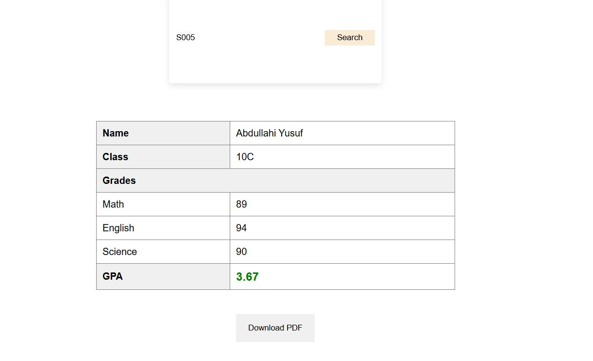

---

# 📘 Student Grade Search App

A fully functional student grade lookup application built using **HTML**, **CSS**, and **JavaScript**, with JSON data handling, GPA calculation, and PDF export capability. Designed for both educational institutions and learning purposes.

---

## 🚀 Features

✅ Search student details by ID  
✅ View student's Name, Class, and Subject-wise Grades  
✅ GPA calculation based on subject grades  
✅ Download grade report as a **PDF file**  
✅ Save searched students in **LocalStorage**  
✅ Responsive design & user-friendly interface

---

## 📸 Preview



---

## 🧰 Tech Stack

| Technology     | Description                          |
|----------------|--------------------------------------|
| HTML/CSS       | Structure and styling                |
| JavaScript     | App logic, GPA, and PDF export       |
| JSON           | Data source for student grades       |
| jsPDF          | JavaScript library for PDF creation  |
| LocalStorage   | Stores previously searched IDs       |

---

## 📁 File Structure

```bash
student-grade-app/
│
├── index.html            # Main webpage
├── style.css             # Styling file
├── script.js             # JavaScript functionality
├── grade.json            # Mock student data
├── README.md             # Project documentation
└── /screenshots          # Optional screenshots directory
```

---

## 📦 Sample JSON Data

```json
[
  {
    "id": "101",
    "name": "Ahmed Ali",
    "class": "10A",
    "grades": {
      "Math": 90,
      "English": 85,
      "Science": 88
    }
  }
]
```

---

## 🧠 GPA Calculation Logic

GPA = (Math + English + Science) / 3  
GPA is rounded to **2 decimal places** using `.toFixed(2)` in JavaScript.

```js
const grades = Object.values(student.grades);
const sum = grades.reduce((a, b) => a + b, 0);
const gpa = (sum / grades.length).toFixed(2);
```

---

## 📥 PDF Download Feature

Uses **jsPDF** to create a downloadable grade report:

```js
const doc = new jsPDF();
doc.text("Student Grade Report", 20, 10);
doc.text(`Name: ${student.name}`, 20, 30);
doc.save(`${student.name}_grades.pdf`);
```

---

## 💾 LocalStorage Use

Previously searched IDs are stored in `localStorage` to auto-load data when the page reloads. Prevents duplicates using `.includes(id)` check.

```js
const stored = JSON.parse(localStorage.getItem('searchHistory')) || [];
if (!stored.includes(id)) {
  stored.push(id);
  localStorage.setItem('searchHistory', JSON.stringify(stored));
}
```

---

## 🛠️ How to Run the App

1. Clone the repo or download ZIP.
2. Make sure `grade.json` is in the same folder.
3. Open `index.html` in your browser.
4. Enter a valid student ID like `101`, `102`, etc.
5. View grades, GPA, and download the report.

---


## 👤 Author

**Mohamed Bashiir**  
Student | Developer   
📧 aminbashir07@gmial.com

---

## 🤝 Contributions

If you'd like to contribute:

1. Fork the repository
2. Create a feature branch (`git checkout -b feature-name`)
3. Commit your changes
4. Push to the branch (`git push origin feature-name`)
5. Open a Pull Request

---


---

